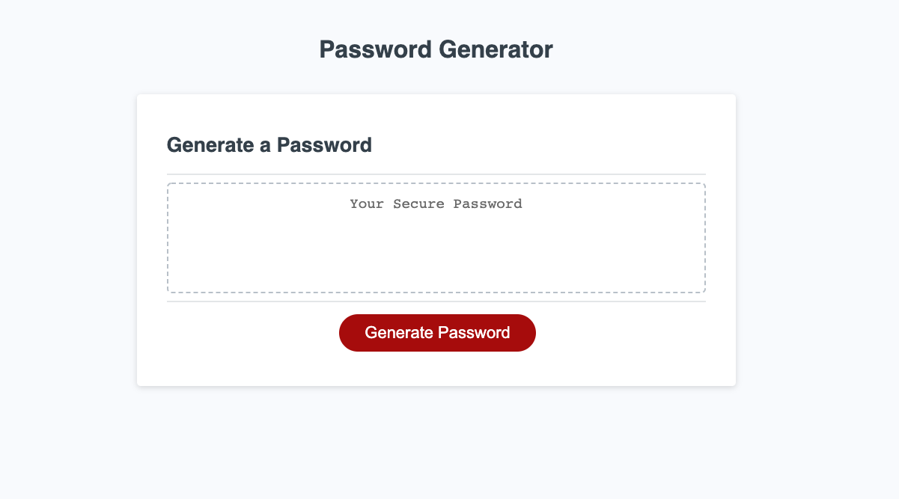

# Password Generator

The Password Generator web application allows users to generate a random password containing their choice of uppercase letters, lowercase letters, numbers, and symbols between 8 and 128 characters long. 

## TABLE OF CONTENTS
- [DESCRIPTION](#Description)  
- [TECHNOLOGIES](#Technologies)  
- [INSTALLATION](#Installation)   
- [CONTRIBUTIONS](#Contributions)
- [LINKS](#Links)  

## Description 

The page will ask the user a series of questions in the form of pop-up windows.  After the user answers all of the prompted questions they must press the "Generate Password" button in the middle of the page.  A password that meets their desired qualifications will appear in the box labeled "Your Secure Password".

## Technologies

- HTML
- Minimum styling with CSS and Bootstrap
- JavaScript

## Installation

No installations necessary.

## Contributions

To develop the Password Generator I worked with Carlo DeFilippis, Erin Platvoet, Ivan Zapata-Rivera, Miguel Jimenez, Andie W, and Maurya.  It was a team effort and would not have been accomplished without Carlo Defilippis willingness to share his extensive background in JavaScript.

## Links

<a href="https://kmvanneste.github.io/Password_Generator/" target="_blank">LINK to view project page</a>

